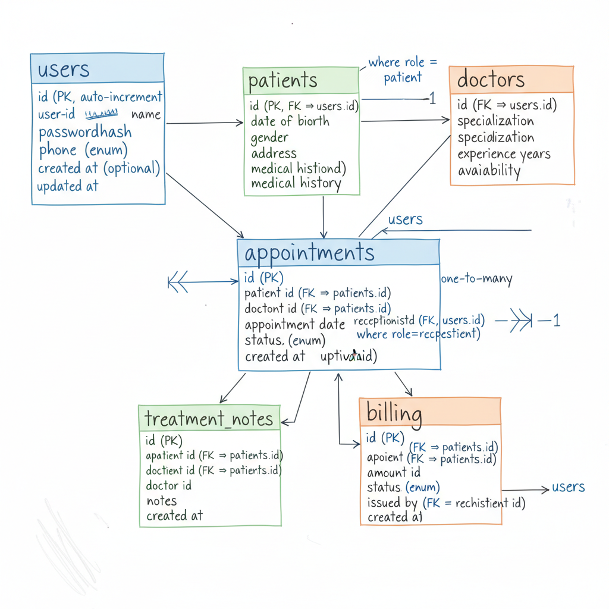
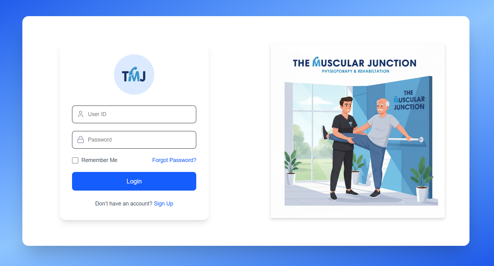

# 🏥 The Muscular Junction – Clinic Management System (MVP)

A **role-based clinic management system** built for a **Physiotherapy Clinic**.  
This **MVP (Minimum Viable Product)** is designed for **simplicity, speed, and clean workflows** — with a **scalable architecture** for future growth.

---

## 📖 Overview

The system streamlines clinic operations with dedicated panels for each role:

- 👨‍💼 **Admin** – Manage all users, data, and reports
- 🩺 **Doctor** – Manage appointments & treatment notes
- 👩‍💻 **Receptionist** – Handle registrations, scheduling, billing
- 👨‍👩‍👦 **Patient** – Access appointments, history, invoices

---

## 🚀 Features (MVP)

<details>
<summary>🔹 Admin Panel</summary>

- Manage **Doctors, Patients, Receptionists**
- Full access to **records & reports**
- Create, update, delete any data

</details>

<details>
<summary>🔹 Doctor Panel</summary>

- View and manage **appointments**
- Add/update **treatment notes**
- Mark sessions as **completed**

</details>

<details>
<summary>🔹 Receptionist Panel</summary>

- Register **new patients**
- Schedule, reschedule, cancel **appointments**
- Collect payments & generate **invoices**

</details>

<details>
<summary>🔹 Patient Panel</summary>

- Secure login with unique **Patient ID** (e.g. `P0001`)
- Update password
- View upcoming **appointments**
- Access **treatment history & notes**
- View & download **invoices**

</details>

---

## 📊 Database Design



---

## 🛠️ Tech Stack

- **Frontend** → Next.js, React, TailwindCSS
- **Backend** → Node.js (Express / NestJS)
- **Database** → PostgreSQL
- **ORM** → Prisma / Sequelize
- **Authentication** → JWT (Role-Based Access Control)

---

## 🎨 Mockups

| Login (Patient)                                  | Login (Admin)                                  |
| ------------------------------------------------ | ---------------------------------------------- |
|  |  |

| Admin Dashboard                                                                  | Receptionist Dashboard                                                                         |
| -------------------------------------------------------------------------------- | ---------------------------------------------------------------------------------------------- |
|  |  |

| Doctor Appointments                                                                      | Billing Module                                                   |
| ---------------------------------------------------------------------------------------- | ---------------------------------------------------------------- |
|  |  |

> ⚡ Real UI screenshots will be added in future versions.

---

## ⚙️ Installation

```bash
# Clone the repository
git clone https://github.com/your-username/the-muscular-junction.git

# Navigate into project
cd the-muscular-junction

# Install dependencies
npm install

# Setup environment variables
cp .env.example .env

# Run database migrations
npx prisma migrate dev

# Start development server
npm run dev

## 🧭 Roadmap

- [x] Role-based authentication (Admin, Doctor, Receptionist, Patient)
- [x] Appointment management
- [x] Billing & invoice system
- [x] Treatment notes
- [ ] Email / SMS notifications
- [ ] Multi-clinic support (Super Admin)
- [ ] Patient online appointment booking

---

## 🤝 Contributing

Pull requests are welcome! 🎉
For major changes, please open an issue first to discuss the feature or fix.

---

## 📜 License

Licensed under the **MIT License**.

---

👉 This format is **optimized for GitHub**:
- Uses collapsible `<details>` sections for role-based features
- Clean tables for mockups/screenshots
- Proper markdown hierarchy
- Works well with GitHub’s dark/light mode

```
